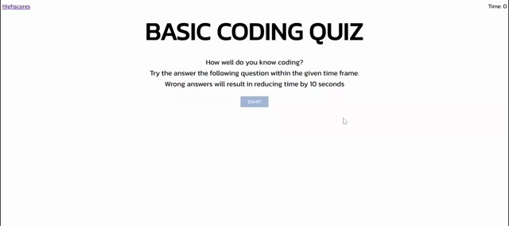

# Be-a-Dev Quiz

## Table of Contents

- [Description](#description)
- [Usage](#usage)
- [Credits](#credits)
- [License](#license)

## Description

This website is a basic quiz about coding. It consists of 5 questions and the user is presented with 4 options. I case of wrong answer, 10 seconds will be deducted from the timer. After finishing, user will be shown their scores and will be asked to add their initials, which would be saved in the highscores page.

## Usage

- Navigate to [Be-a-Dev Quiz](https://rak100.github.io/be-a-dev/) to view the web page
- [Be-a-Dev Quiz](https://github.com/rak100/be-a-dev.git) in GitHub.

## Credits

Created by [Rana Ahmad](https://github.com/rak100)

## License

